# ADK Resumability, From the Ground Up

How an ADK agent pauses for a human decision, survives a process restart, and picks
up days later — explained by building the data model first, then tracing one
expense approval through it, object by object.

Verified against **ADK Python 2.3.0**. The APIs here (`ResumabilityConfig`,
`request_confirmation`) are marked `@experimental`. Pin your version.

---

## 1. The scenario

An employee asks an agent to reimburse an expense. Under $100 the agent just pays
it. $100 or more needs a manager's approval, and the manager may approve a lower
amount than requested.

The manager is a person. They might answer in ten minutes or next Tuesday, through
a dashboard that has no connection to the HTTP request that started the agent run.
So:

1. **No process can block** waiting for them.
2. **The conversation must survive** the wait — when the decision arrives, work
   continues in the same conversation, with the model still aware of the context.
3. **A different process may finish the work** than the one that started it.

The rest of this document explains how ADK makes that possible. We follow one
conversation: a greeting, then *"Reimburse my $250 conference ticket,"* from start
to finish.

---

## 2. The objects

Five objects are involved. Everything else in this document is these five
interacting. Here is how they relate; each gets its own subsection below.

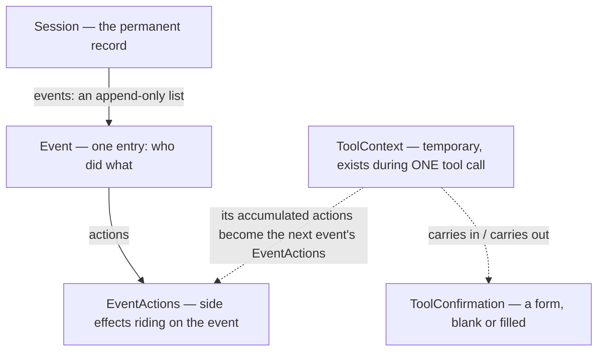

### 2.1 Session — the conversation's permanent record

A `Session` is a persistent record, stored by a *session service* (in production, a
database). One session per conversation.

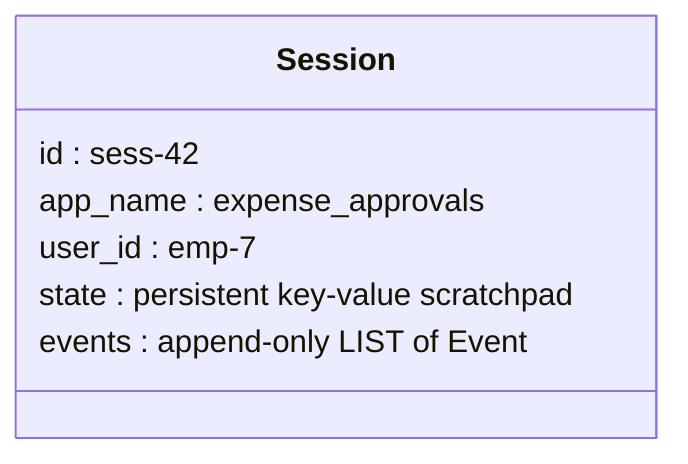

There is no event queue anywhere. `events` is a plain Python list, append-only.
The session IS the conversation: everything anyone said or did, in order.
This list is the thing that survives process restarts.

### 2.2 Event — one entry in that list

Every turn of activity appends `Event` objects. An event says *who* did *what*:

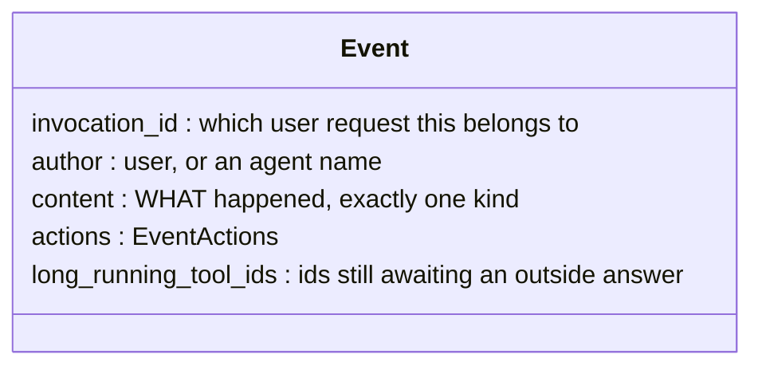

An **invocation** is all the work triggered by one user request. In plain chat,
each user message starts a new invocation: in our trace, "hi there" and the
agent's reply are `inv-1`, and the "$250 ticket" message starts `inv-2` — along
with every event it causes: model decisions, tool runs, the eventual approval,
even events created days apart. So a session holds many invocations, and normally
the boundaries line up with user turns. The one exception is the subject of this
document: a user message that *answers a pending question* (a function response)
joins the invocation that asked, rather than starting its own. That is what
"resuming" means at the data level.

The `content` of an event is one of three kinds. Learn to tell them apart, because
the trace hinges on which kind each event is:

| Kind | Meaning | Example |
|---|---|---|
| **text** | someone said something | "Reimburse my $250 ticket" |
| **FunctionCall** | the model wants a function run. Carries a `name`, `args`, and an **`id`** ADK generates so the answer can be matched to the question | `request_approval(amount=250)`, id `fc-1` |
| **FunctionResponse** | the answer to a FunctionCall. Carries the **same `id`** as the call it answers, plus a `response` dict | id `fc-1`, `{"status": "pending..."}` |

The call/response `id` is the pairing mechanism. Everything in this document —
including the resume itself — works by matching a FunctionResponse's `id` to an
earlier FunctionCall's `id`.

### 2.3 EventActions — the side-effect record attached to each event

Besides its `content`, each event carries an `EventActions` object: a structured
record of side effects that happened while producing that event.

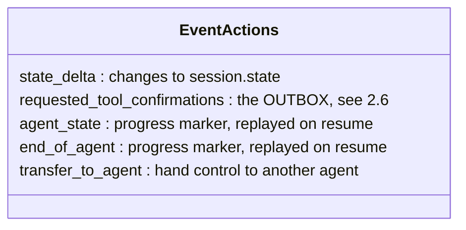

Every event has one, strictly 1:1 — created empty alongside the event itself
(`actions: EventActions = Field(default_factory=EventActions)`, `event.py:112`).
Most stay nearly empty forever. The one this document cares about has an unusual
biography, covered in §2.4.

Why does this exist? Because a tool can't write to the session directly — events
are the only thing that gets persisted. So a tool's side effects are collected in
an `EventActions`, which is then attached to the tool's response event, which is
appended to `session.events` and saved. The side effects hitch a ride on the event.

The clearest example is a state write. When your tool does

```python
tool_context.state["requested_amount"] = 250.0
```

nothing touches the session at that moment. The assignment is recorded as
`state_delta: {"requested_amount": 250.0}` in the `EventActions`, rides into
the response event, and is applied to `session.state` when the event is saved.
That is *why* `tool_context.state` survives a multi-day pause while an ordinary
Python variable doesn't: the write became part of the permanent record.

Other fields work the same way, differing only in who writes them: you write
`state_delta` (via `.state`) and `requested_tool_confirmations` (via
`request_confirmation()`); the framework writes `transfer_to_agent` (hand control
to another agent) and the progress markers `agent_state` / `end_of_agent` that
resumption replays. In every case the rule is the same: an event's `content` is
what was said; its `actions` are what should change or happen as a result — and
both persist only because they're on an event.

### 2.4 ToolContext — the temporary object handed to your tool

When the model asks for a tool, ADK builds a **`ToolContext`**: a short-lived,
in-memory object that exists for **one tool execution** and is discarded when your
function returns. It is not an event and is never stored. If your tool function
declares a parameter of this type, ADK passes it in.

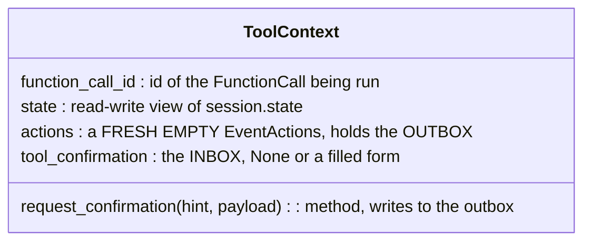

When your function returns, ADK wraps the returned dict in a FunctionResponse
event and attaches `tool_context.actions` to it — by reference, not as a copy:

```python
function_response_event = Event(..., actions=tool_context.actions)   # functions.py:1197
```

The object your tool mutated *becomes* the event's `actions`, displacing the
default empty one every event otherwise gets. This is the unusual biography from
§2.3: every other event's `EventActions` is born together with its event; this one
is born earlier, with the ToolContext, giving your code a window to write into a
record that will later be persisted. After the handoff the `ToolContext` is
garbage. Next time the tool runs — even to resume this same
paused work — a brand-new `ToolContext` is built.

### 2.5 ToolConfirmation — a form, used in two directions

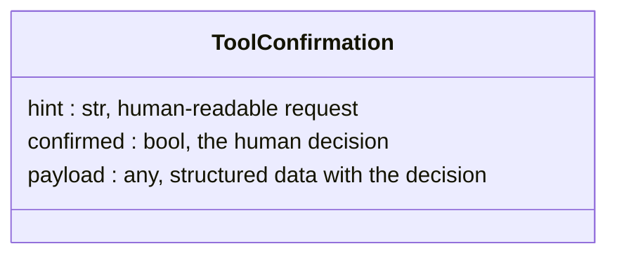

**The class name is misleading, and it caused real confusion earlier in this
document's history, so let's be blunt:** ADK uses this one class for two different
objects that travel in opposite directions:

1. **The request (outgoing).** When your tool asks for a human decision, it creates
   a `ToolConfirmation` that is really a *blank form*: `hint` describes what's
   needed, `payload` holds **placeholder values that declare the shape of the
   expected answer** (e.g. `{"approved_amount": 0.0}` means "a float goes here"),
   and `confirmed=False` is meaningless filler. Nothing has been confirmed —
   nothing has even been asked yet.

2. **The answer (incoming).** Days later, a *different* `ToolConfirmation` instance
   is built from the manager's actual response: `confirmed` is their real decision,
   `payload` has real numbers. The class name only makes sense for this one.

Same class. Two instances. Opposite directions. When you see a `ToolConfirmation`,
always ask: is this the blank form going out, or the filled form coming in?

### 2.6 The outbox and the inbox

The two directions live in two different places on `tool_context`, with confusingly
similar names. This distinction is the single most important thing in this
document:

| | Where | Who writes it | What it holds |
|---|---|---|---|
| **OUTBOX** | `tool_context.actions.requested_tool_confirmations` | **you**, via `request_confirmation()` | the blank form |
| **INBOX** | `tool_context.tool_confirmation` | **ADK**, when building the ToolContext | `None` the first time; the filled form when resuming |

`request_confirmation()` writes to the outbox. It never touches the inbox. Here is
its entire implementation — and note that since it's a method on the context class,
**`self` here IS your `tool_context`**, and `self._event_actions` is the private
name for what you see as `tool_context.actions`:

```python
# inside the context class (agents/context.py:734); self == your tool_context
def request_confirmation(self, *, hint=None, payload=None) -> None:
    self._event_actions.requested_tool_confirmations[self.function_call_id] = (
        ToolConfirmation(hint=hint, payload=payload)
    )
```

One dict write, then it returns. It does not block, does not contact anyone, does
not return an answer. The outbox is a plain `dict[str, ToolConfirmation]` (not a
special class); it's a dict rather than a single slot only because one model turn
can invoke several tools at once, each contributing its own entry when their
response events are merged. In this document there is always exactly one entry,
keyed by the tool call's id (`"fc-1"`).

That's the whole vocabulary. Now the story.

---

## 3. Turn one: the pause

We watch `session.events` grow, one step at a time. In each diagram the **green
border** marks what the step added. (Full code for the agent and server is in §6;
here we follow the objects.)

### Step 0 — a greeting, to set the baseline

Before any expenses, the employee says hi. This is a complete, ordinary
invocation — two events, over in a second — shown so the interesting one can be
compared against it:

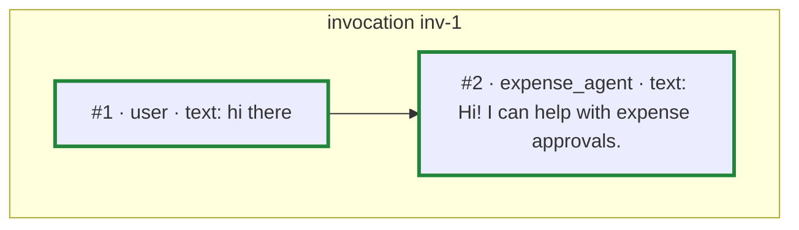

User message starts an invocation; agent replies; nothing left to do; invocation
complete. Every plain chat turn looks like this.

### Step 1 — the expense request becomes event [3]

The employee sends *"Reimburse my $250 conference ticket."* The server calls
`runner.run_async(new_message=...)`. A new user message means a new invocation:
`inv-2`.

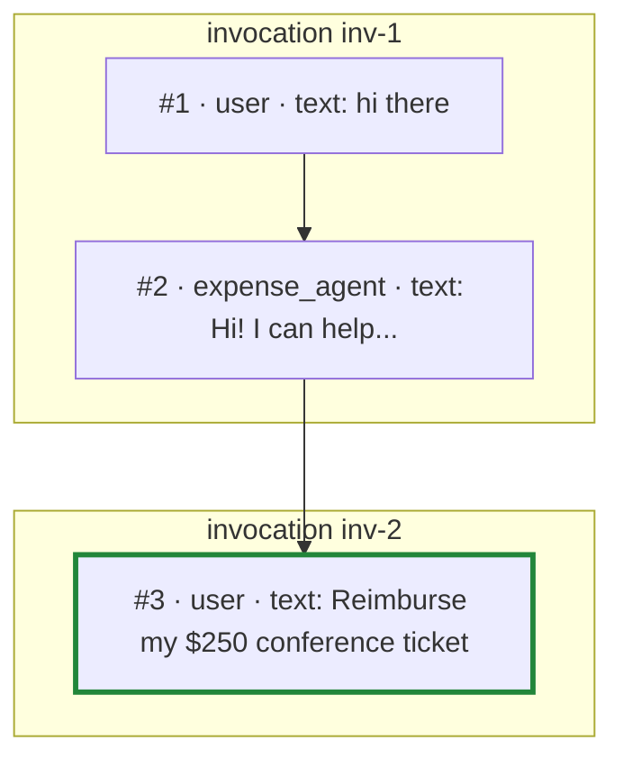

### Step 2 — the model decides to call the tool: event [4]

ADK sends the conversation to the model. The model, following its instructions
($250 ≥ $100), answers not with text but with a FunctionCall. ADK assigns it the
id `fc-1` and appends:

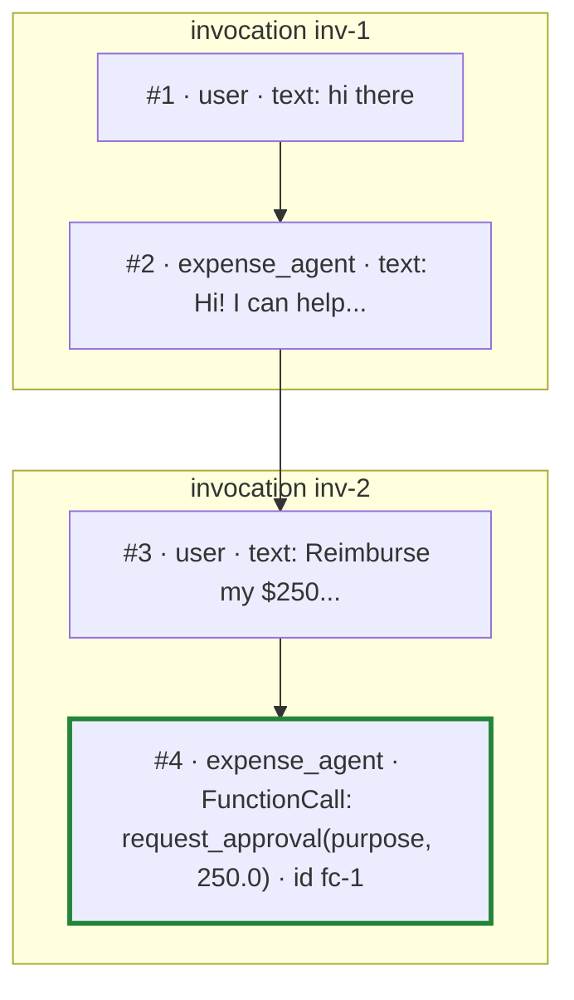

A note on ids: `fc-1` is this document's label, chosen for readability. Real ids
are opaque — `generate_client_function_call_id()` (`functions.py:222`) returns
`adk-<uuid>`, and every id in this trace, including step 5's synthetic one, has
that identical format. Nothing about an id's shape tells you what kind of call it
belongs to.

### Step 3 — ADK builds a ToolContext (not an event)

To execute that call, ADK constructs the temporary object from §2.4. Nothing is
appended to the session; this object lives only in memory, only for this call:

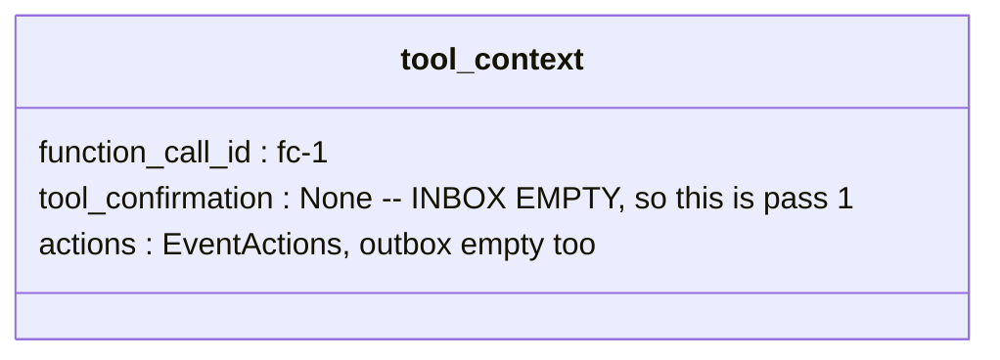

The empty inbox is how your code will know it's the first pass.

### Step 4 — your tool runs (pass 1) and fills the outbox

Your function executes. The inbox is empty, so it takes the first branch:

```python
tool_context.request_confirmation(
    hint="Manager approval needed: conference ticket, $250.00",
    payload={"approved_amount": 0.0},        # blank form: "a float goes here"
)
return {"status": "pending_manager_approval", "amount": 250.0}
```

After the `request_confirmation` line, the outbox contains one entry — the blank
form, keyed by this call's id:

```python
tool_context.actions.requested_tool_confirmations == {
    "fc-1": ToolConfirmation(
        hint="Manager approval needed: conference ticket, $250.00",
        confirmed=False,                     # filler; nothing has been decided
        payload={"approved_amount": 0.0},    # placeholder declaring the shape
    )
}
```

Then the function returns a plain Python dict — its return value, nothing more.
**The `return` is what ends the tool.** `request_confirmation` only left a note in
the outbox; it did not pause anything by itself. Still no new event.

### Step 5 — ADK turns the outbox into a question for the outside world: event [5]

ADK now holds two things: your return dict, and your outbox. It builds the
response event in memory (appended as [6] in the next step), and then a check
fires — the first line of `generate_request_confirmation_event`
(`functions.py:345`), reading the outbox off that freshly built event:

```python
if not function_response_event.actions.requested_tool_confirmations:
    return None            # empty outbox → no synthetic call, nothing pending

for function_call_id, tool_confirmation in (
    function_response_event.actions.requested_tool_confirmations.items()):
  request_confirmation_function_call = types.FunctionCall(
      name='adk_request_confirmation',
      args={'originalFunctionCall': ...,   # a copy of your fc-1 call
            'toolConfirmation': ...},      # your blank form
  )
  request_confirmation_function_call.id = generate_client_function_call_id()
  long_running_tool_ids.add(request_confirmation_function_call.id)
```

The rule is mechanical, with no configuration involved: a non-empty outbox always
produces a synthetic **second FunctionCall** — not made by the model, made by
ADK — addressed to whoever is driving this session, and every outbox entry adds
one pending id to the event's `long_running_tool_ids`:

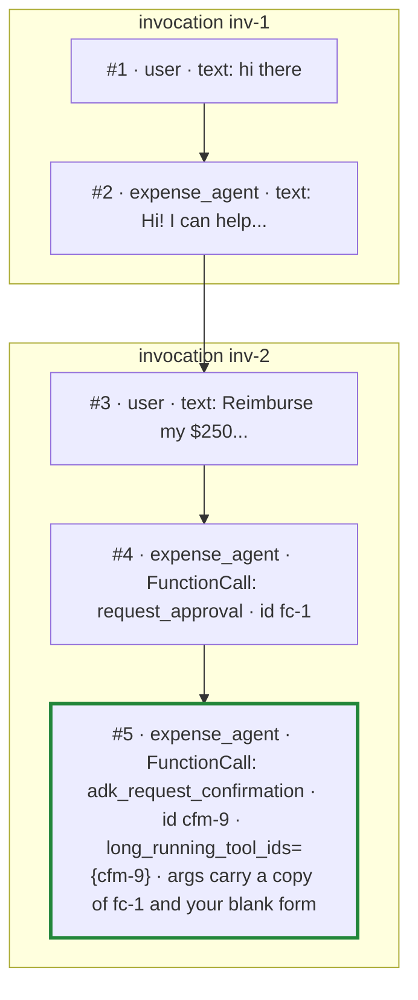

Read that carefully, because it is the pivot of the whole design:

- It is a *question*, expressed as a function call, with a **brand-new id**
  `cfm-9`. There are now two ids in play: `fc-1` (the model's call to your tool)
  and `cfm-9` (ADK's question to the outside world). (`cfm-9` is again a label;
  the real id is another `adk-<uuid>`, indistinguishable in format from `fc-1` —
  what distinguishes the synthetic call is its *name* and the marker below.)
- Your original call and your blank form are nested inside its `args` — so
  anyone reading this one event knows what's being asked and on whose behalf.
- `long_running_tool_ids` marks it as awaiting an external answer. Note this is
  not a boolean flag — it is a *set of call ids*, empty on almost every event,
  listing which of this event's calls will be answered from outside the
  process, later. A non-empty set is how anything — your server, ADK's own
  CLI — discovers there's a pending question in a session. The converse doesn't
  hold, though: the same set is also populated when the model calls a
  `LongRunningFunctionTool` (`base_llm_flow.py:106`), a separate ADK feature
  for fire-and-forget background jobs, with no outbox involved — which is why
  the server in §6 checks both set membership *and* the function name.

**The outside world will answer `cfm-9`, never `fc-1`.** Getting this wrong (as an
earlier version of this document did) means your answer is silently ignored.

### Step 6 — your tool's return value is recorded: event [6]

Now ADK wraps your return dict in a FunctionResponse event, with your outbox
attached as its `actions`:

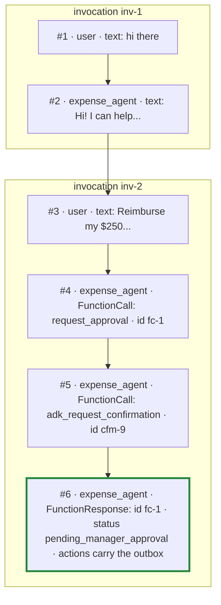

The `ToolContext` from step 3 is now discarded. Its outbox survives inside this
event.

### Step 7 — the model closes the turn: event [7]

The model sees the pending status (your instruction told it what that means) and
replies with text:

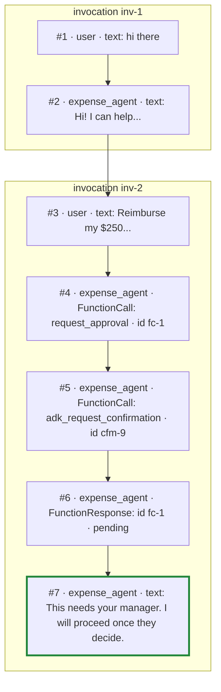

The `run_async` generator finishes. **This is the pause.** Note what it is *not*:
no thread is sleeping, no coroutine is frozen, no callback is registered. The
"pause" is purely a fact about data: `session.events` contains a question
(`cfm-9`) that nothing has answered yet. The process could exit right now — and in
production, it effectively does.

### Step 8 — the question leaves ADK: a ticket in the approval system

Your server was consuming the event stream. When event [5] came through with
`long_running_tool_ids` set, the server extracted the human-facing request (the
`hint` and the original call's args) plus the resume coordinates, and handed
both — in an ordinary HTTP POST — to the **approval system**: a separate
service (dashboard, Slack flow, SaaS) that will show the manager a form and
notify them. The approval system has to
store a record regardless: something must hold the request the manager will
eventually look at. That record is the ticket, and the resume coordinates ride
along inside it as opaque strings:

| Ticket field | Value | |
|---|---|---|
| `ticket_id` | `exp-1` | the approval system's own key |
| `hint` | "Manager approval needed: conference ticket, $250.00" | what the manager sees |
| `resume_context.confirmation_id` | `cfm-9` | ← the reattach key. THE thing to carry. |
| `resume_context.user_id` / `.session_id` | `emp-7` / `sess-42` | locate the session |

Note the resume context holds all three coordinates: `user_id` and `session_id`
(which will locate the *session*) plus `confirmation_id` (which will locate the
*invocation inside it*). Step 9 needs all three, and the approval system is what
will eventually deliver them back — so it is given all three now. It never
interprets them; to it they are three opaque strings stored next to the hint.
This is the same shape as Google's own long-running-agent example, where the
external system's callback carries the session coordinates back to the agent's
webhook. The agent server itself keeps **no state at all** between turns.

The HTTP request returns. Turn one is over.

---

## 4. The gap

Hours or days pass. The agent server redeploys twice and the resume will land on a
different replica. None of that matters, because the entire memory of this pause
is seven events in the session store plus one ticket row in the approval system:

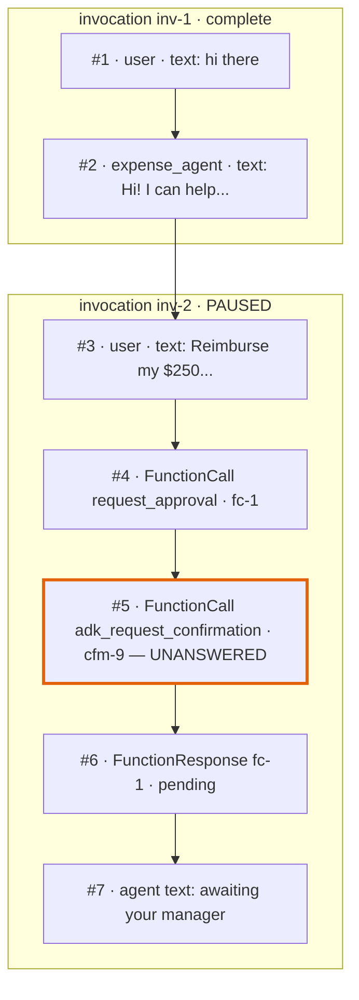

The one thing that would break this: an in-memory session service. Then the
"permanent record" dies with the process, and there is nothing to resume.

---

## 5. Turn two: the resume

The manager opens the dashboard and approves — but only $200 of the $250.

### Step 9 — the decision becomes event [8]

The approval system marks ticket `exp-1` decided and calls your server back,
returning the decision *together with the resume context it was handed in step
8*, verbatim:

```json
POST /approvals/decide
{
  "confirmation_id": "cfm-9",
  "user_id": "emp-7",
  "session_id": "sess-42",
  "approved": true,
  "approved_amount": 200.0
}
```

Note what the approval system does *not* do: it never touches ADK. No ADK
types, no session knowledge — the three ids are strings it stored and returned
unread, and your agent server (which already has ADK loaded for the runner) is
the translator. ADK types never cross a wire anywhere — HTTP carries JSON, and
`types.FunctionResponse` is just the Python SDK's way of building it.

The server builds the answer from the payload alone — no lookup, no state of
its own — **answering the synthetic question**. Three nested layers — the
outermost is what `run_async` receives:

```python
answer = types.Content(                        # ONE user turn — this becomes new_message
    role="user",                               # the processor only reads user events
    parts=[types.Part(                         # a turn is a list of parts
        function_response=types.FunctionResponse(  # a part holds text OR a call OR a response
            id=decision.confirmation_id,       # "cfm-9" — the SYNTHETIC id, not fc-1
            name="adk_request_confirmation",   # this exact string
            response={"confirmed": True, "payload": {"approved_amount": 200.0}},
        ))],
)

runner.run_async(
    user_id=decision.user_id,        # ← these two locate the SESSION —
    session_id=decision.session_id,  #   an ordinary keyed lookup, no searching
    new_message=answer,              # ← the id inside will locate the INVOCATION
)
```

`new_message` is always "one user turn." Usually the part contains text ("hi
there"); here it contains a function response instead. Same envelope, different
filling — which is why the resulting event is authored `user` even though no
human typed anything: the manager's decision *is* the user side's next turn. The
three FunctionResponse fields must be exact, or ADK's filter drops the message
without error.

**Variation: when the callback can't carry your fields.** Some external systems
have a fixed callback payload you can't extend. The pattern survives: hand the
system an opaque reference instead — typically in the callback URL you register
with it (`POST /approvals/exp-1/decide`) — and keep the reference-to-coordinates
mapping in a table on your side, looked up when the callback arrives. Either
way, exactly one record exists outside ADK while the question is pending; the
only question is which side holds the coordinates. In both designs,
authenticate the callback endpoint: anyone who can reach it can inject
decisions into paused sessions.

Back to the main path: ADK appends the answer — and look at which invocation it
lands in:

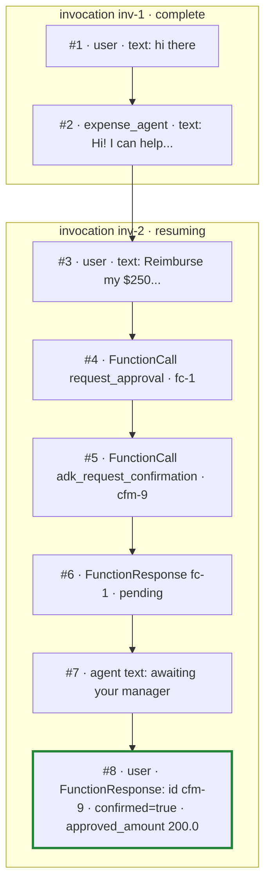

A user-authored event, days after the last one — and it's stamped `inv-2`, not
`inv-3`. A plain text message here would have started `inv-3` (like the greeting
started `inv-1`). This one didn't, because of the next step. That single detail
IS resumption, seen at the data level.

### Step 10 — reattach: which invocation does this continue?

The *session* was already found the ordinary way — a keyed lookup by
`(app_name, user_id, session_id)`, all supplied by the callback. What's still
unresolved is which *invocation within it* this message continues. `run_async`
notices the message is a FunctionResponse and does the only sensible thing: scan
`session.events` for the FunctionCall with the matching id. It finds event [5]
(`cfm-9`), reads its `invocation_id` — **`inv-2`**. Conclusion: this is not a new
request; it is the continuation of the paused one. (This only happens because
`is_resumable=True`; without the flag, a trailing function response is treated as
a fresh turn for the root agent and the paused work is silently abandoned.)

### Step 11 — rebuild: reconstruct where inv-2 was

Nothing from turn one's process exists anymore, so ADK rebuilds from the log
alone: it recovers the original user message (event [3]), replays the
`agent_state` / `end_of_agent` markers to learn which agents already finished
(none), and identifies which agent was mid-work — the author of the paused call.
The log is sufficient; that is the entire trick of resumability.

### Step 12 — translate: from the wire answer to your tool's inbox

A dedicated processor now connects event [8] back to your tool, in three moves:

1. **Parse** — the input is the innermost layer of the answer built in step 9:
   the `response=` dict of the `FunctionResponse`,
   `{"confirmed": True, "payload": {"approved_amount": 200.0}}`, now persisted
   inside event [8]. ("Response" here is the §2.2 sense — the answer paired to
   a FunctionCall — not an HTTP response.) The processor walks the event list
   backwards to the most recent user-authored event, keeps only responses named
   `adk_request_confirmation`, and hands each `response` dict to pydantic
   (`request_confirmation.py:41`):

   ```python
   def _parse_tool_confirmation(response: dict) -> ToolConfirmation:
       ...
       return ToolConfirmation.model_validate(response)   # dict → the filled form
   ```

   The result is a filled `ToolConfirmation` — §2.5's *incoming* direction:
   `confirmed=True, payload={"approved_amount": 200.0}`. It is a **new** object,
   not the blank form you created in step 4; that object's job ended when it was
   displayed to the manager.
2. **Map** — open event [5]'s `args.originalFunctionCall` and learn that answering
   `cfm-9` means resuming the tool call `fc-1`.
3. **Dedup** — check whether `fc-1` already got a second answer (a manager
   double-clicking Approve). If so, stop here; the duplicate becomes a no-op.

The three moves end holding a pair: *which call to re-run* (`fc-1`, from the
map) and *the filled form* (from the parse). That pair is the whole point of
this step — step 13 re-executes `fc-1` with the filled form placed in the new
ToolContext as `tool_context.tool_confirmation`. This is the only way the inbox
is ever populated: nothing in turn one wrote it, and your tool cannot write it.

### Step 13 — your tool runs again (pass 2), from the top: event [9]

ADK builds a **brand-new ToolContext** — same `function_call_id`, but this time
the inbox holds the filled form that step 12 parsed:

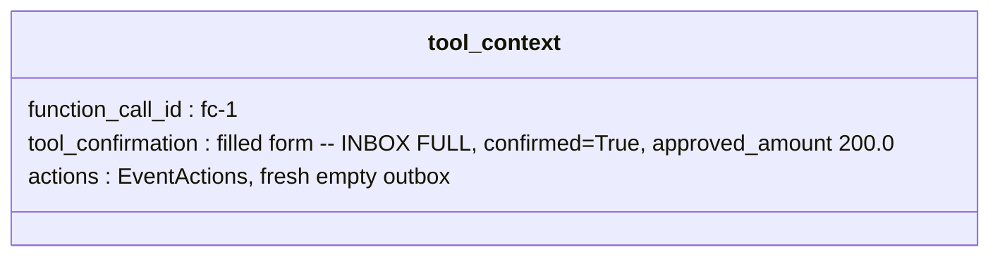

Then it calls your function again. **From the top — line one.** There is no saved
position inside your function; the function ran to completion in turn one and this
is simply a second complete execution. The *only* difference between the two runs
is the inbox. That is why the function is written as a branch:

```python
confirmation = tool_context.tool_confirmation
if not confirmation:            # pass 1 took this branch
    ...
# pass 2 takes this path:
approved = (confirmation.payload or {}).get("approved_amount", 0.0)   # 200.0
return {"status": "approved", "approved_amount": min(approved, 250.0)}
```

The return is recorded as a second answer to `fc-1`:

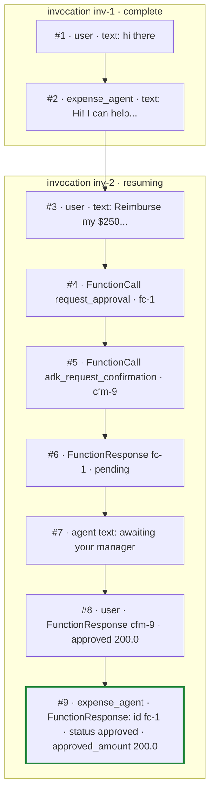

### Step 14 — the model finishes the job: events [10]–[12]

The model — still inside `inv-2`, with the whole history in view — sees the
approval and follows its instructions to completion:

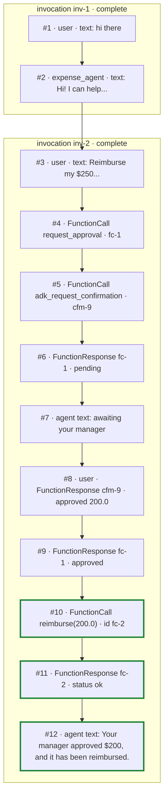

The invocation completes. Twelve events, two invocations: `inv-1` closed in a
second; `inv-2` spanned days, three user turns, and (potentially) two different
processes.

---

## 6. The code

Everything above, as the three components you'd actually deploy. Comments
reference the step numbers from the trace.

### 6.1 The agent

```python
# agent.py
from google.adk.agents import LlmAgent
from google.adk.apps import App, ResumabilityConfig
from google.adk.tools import ToolContext

import payments      # your payment provider's client; not shown


def reimburse(purpose: str, amount: float, tool_context: ToolContext) -> dict:
    """Reimburse an approved amount to the employee."""
    # Resume guarantees at-least-once, so guard the money movement (§8). The
    # call id ADK recorded for this call is stable across a re-execution, so
    # it serves as the idempotency key.
    payments.pay(idempotency_key=tool_context.function_call_id, amount=amount)
    return {"status": "ok", "reimbursed": amount, "purpose": purpose}


def request_approval(purpose: str, amount: float, tool_context: ToolContext) -> dict:
    """Request manager approval for an expense of $100 or more."""

    confirmation = tool_context.tool_confirmation      # the INBOX (§2.6)

    if not confirmation:
        # PASS 1 (trace step 4): inbox empty. Put a blank form in the outbox...
        tool_context.request_confirmation(
            hint=f"Manager approval needed: {purpose}, ${amount:.2f}",
            payload={"approved_amount": 0.0},          # declares the answer's shape
        )
        # ...and end the tool. THIS return is what pauses the invocation.
        return {"status": "pending_manager_approval", "amount": amount}

    # PASS 2 (trace step 13): inbox holds the filled form.
    approved = (confirmation.payload or {}).get("approved_amount", 0.0)

    # Check BOTH fields: confirmed=True with amount 0 is a rejection in disguise.
    if not confirmation.confirmed or approved <= 0:
        return {"status": "rejected", "approved_amount": 0.0}

    return {"status": "approved", "approved_amount": min(approved, amount)}


root_agent = LlmAgent(
    name="expense_agent",
    model="gemini-flash-latest",
    instruction=(
        "You process employee expense reimbursements.\n"
        "- Under $100: call reimburse directly.\n"
        "- $100 or more: call request_approval FIRST. If it returns "
        "pending_manager_approval, tell the user it awaits their manager and stop. "
        "If it returns approved, call reimburse with approved_amount (which may be "
        "less than requested). If rejected, explain and do not reimburse."
    ),
    tools=[reimburse, request_approval],
)

app = App(
    name="expense_approvals",
    root_agent=root_agent,
    resumability_config=ResumabilityConfig(is_resumable=True),   # enables step 10
)
```

### 6.2 The agent server

Two endpoints. `/chat` runs turn one and, while streaming the events, watches
for the pause. `/approvals/decide` receives the approval system's callback and
runs turn two. The approval system is a separate service (§6.3); the two talk
to each other only via plain HTTP POSTs.

How the pause detection reads: an event's `content` is a list of parts (§2.2),
and one model turn may request several tools at once, so a single event can
carry several FunctionCalls. `event.get_function_calls()` is a convenience
accessor that collects them — it returns the `types.FunctionCall` objects found
in the event's parts, an empty list for text-only events (most of them, so the
loop body usually never runs). Each call then has to pass two guards: it is
listed in the event's `long_running_tool_ids` (so its answer will come from
outside), *and* it is named `adk_request_confirmation` (so it is the synthetic
question, not a `LongRunningFunctionTool` job — §3 step 5). In this trace, only
the one call in event [5] passes both.

```python
# server.py
from fastapi import FastAPI
from pydantic import BaseModel

from google.adk.runners import Runner
from google.adk.sessions import DatabaseSessionService   # pip install google-adk[db]
from google.genai import types

from agent import app as adk_app

APPROVAL_SYSTEM = "https://approvals.internal"   # §6.3 — a separate service
# http_post(url, json=...) below = any HTTP client (httpx, requests); auth omitted.

# Durable, or there is nothing to resume (§4).
session_service = DatabaseSessionService(db_url="postgresql://.../adk")

runner = Runner(app=adk_app, session_service=session_service)
api = FastAPI()


@api.post("/chat")
async def chat(user_id: str, session_id: str, text: str):
    """Turn one. Streams events; files a ticket if the agent pauses."""
    reply = []

    async for event in runner.run_async(
        user_id=user_id,
        session_id=session_id,
        new_message=types.Content(role="user", parts=[types.Part(text=text)]),
    ):
        # Trace step 8: watch for the pause. In this trace only event [5]
        # gets past the two guards below.
        for fc in event.get_function_calls():
            if fc.id not in (event.long_running_tool_ids or set()):
                continue    # ordinary call; its answer arrives within this run
            if fc.name != "adk_request_confirmation":
                continue    # a LongRunningFunctionTool job, not a question
            # The synthetic question. fc.args is exactly what step 5's code
            # packed: the blank form plus a copy of the original call. File
            # a ticket with the approval system — an ordinary HTTP call to
            # another service.
            http_post(f"{APPROVAL_SYSTEM}/tickets", json={
                "hint": fc.args["toolConfirmation"]["hint"],
                "original_args": fc.args["originalFunctionCall"]["args"],
                # The resume context. The approval system stores these as
                # opaque strings and returns them verbatim with the
                # decision (step 9).
                "resume_context": {
                    "confirmation_id": fc.id,    # cfm-9: the reattach key
                    "user_id": user_id,
                    "session_id": session_id,
                },
            })

        if event.content and event.content.parts:
            reply.append(event.content.parts[0].text or "")

    return {"reply": "".join(reply)}


class Decision(BaseModel):
    """The approval system's callback body. The decision fields are its news;
    the three ids are the resume context from step 8, returned verbatim. This
    shape is YOUR contract with the external system — ADK never sees it."""
    confirmation_id: str
    user_id: str
    session_id: str
    approved: bool
    approved_amount: float


@api.post("/approvals/decide")
async def decide(decision: Decision):    # FastAPI parses the JSON body into a Decision
    """Turn two. Stateless: everything needed to resume is in the payload."""

    # Trace step 9: translate the callback's JSON into the answer ADK expects.
    # The three FunctionResponse fields must be exact or the answer is ignored.
    answer = types.Content(
        role="user",                                   # processor reads user events only
        parts=[types.Part(function_response=types.FunctionResponse(
            id=decision.confirmation_id,               # the SYNTHETIC id, not the tool's
            name="adk_request_confirmation",           # this exact literal
            response={
                "confirmed": decision.approved,
                "payload": {"approved_amount": decision.approved_amount},
            },
        ))],
    )

    # user_id + session_id locate the session; the id inside the answer locates
    # the invocation (step 10). No invocation_id parameter needed. A duplicate
    # callback (a manager double-click) is dropped by ADK's dedup (step 12).
    tail = []
    async for event in runner.run_async(
        user_id=decision.user_id,
        session_id=decision.session_id,
        new_message=answer,
    ):
        if event.content and event.content.parts:
            tail.append(event.content.parts[0].text or "")

    return {"resumed": True, "agent_said": "".join(tail)}
```

### 6.3 The approval system

A **separate service** — the dashboard's backend, a Slack approval flow, a SaaS
product. Different deployment, possibly a different team and repo. Everything
it shares with the agent server is two JSON shapes over HTTP: it receives a
ticket (§6.2's POST), and it sends back a decision. It never imports ADK; its
only ADK-adjacent duty is storing three opaque strings and returning them
verbatim with the decision.

```python
# approval_service.py — a separate deployment. No ADK anywhere.
from fastapi import FastAPI
from pydantic import BaseModel

AGENT_SERVER = "https://agent-server.internal"

api = FastAPI()


class ResumeContext(BaseModel):
    """Three opaque strings from the agent server. This service never reads
    them; its only duty is returning them verbatim with the decision."""
    confirmation_id: str    # "cfm-9"
    user_id: str            # "emp-7"
    session_id: str         # "sess-42"


class TicketIn(BaseModel):
    """The body of the agent server's POST /tickets (§6.2) — the wire shape."""
    hint: str               # "Manager approval needed: conference ticket, $250.00"
    original_args: dict     # {"purpose": "conference ticket", "amount": 250.0}
    resume_context: ResumeContext


_TICKETS: dict[str, dict] = {}      # a real DB in production


@api.post("/tickets")
def create_ticket(t: TicketIn):     # FastAPI parses the JSON body into a TicketIn
    ticket_id = f"exp-{len(_TICKETS) + 1}"
    _TICKETS[ticket_id] = {
        "request": t,               # what the agent server sent, kept whole
        "status": "pending",        # this service's own bookkeeping; never sent anywhere
    }
    notify_manager(ticket_id)       # email / Slack / dashboard row
    return {"ticket_id": ticket_id}


def decide(ticket_id: str, approved: bool, approved_amount: float):
    """The dashboard's Approve button lands here (trace step 9)."""
    ticket = _TICKETS[ticket_id]
    ticket["status"] = "decided"
    context = ticket["request"].resume_context
    http_post(f"{AGENT_SERVER}/approvals/decide", json={
        "confirmation_id": context.confirmation_id,     # the three ids,
        "user_id": context.user_id,                     # returned verbatim
        "session_id": context.session_id,
        "approved": approved,
        "approved_amount": approved_amount,
    })
```

---

## 7. The sequence diagrams

The same trace as interactions between components. Event numbers match §3 and §5.

### The pause

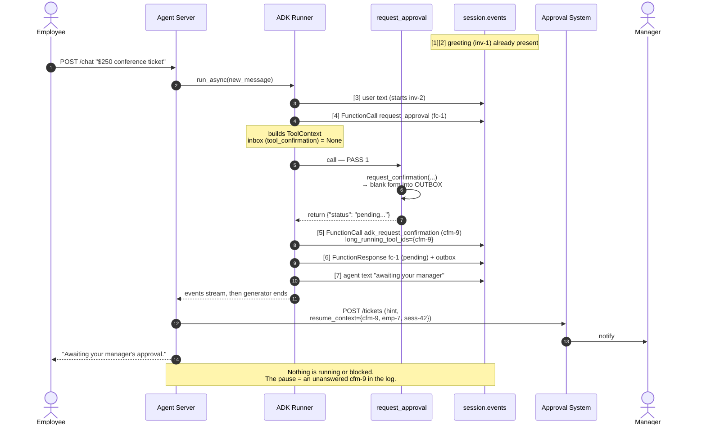

### The resume

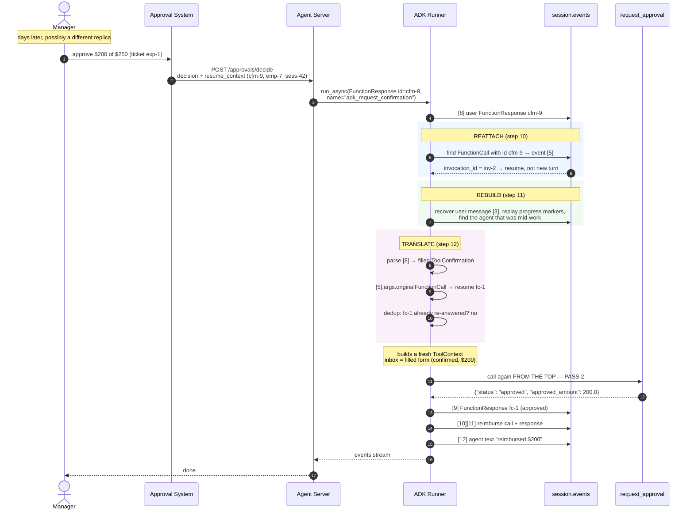

---

## 8. Rules and caveats

### What `is_resumable=True` actually buys you

The reattach in step 10 is gated on it: only with the flag does ADK route a
trailing function response back to the agent that asked. Without it, the response
starts a fresh turn at the root agent and the paused work is silently abandoned.
It also lifts the requirement that every `run_async` call carry a new user
message, enabling crash recovery (`run_async(invocation_id=...)` with no message —
resume a half-finished invocation after a process died mid-run).

### Resumption is best-effort — ADK's words, not mine

> 1. Tool call to resume needs to be idempotent because we only guarantee an
>    at-least-once behavior once resumed.
> 2. Any temporary / in-memory state will be lost upon resumption.

**Idempotency:** at-least-once plus "the function runs from the top" means a tool
can execute its side effects twice. ADK's dedup (step 12) stops a *duplicate
resume*; it does not stop a re-executed call *within* one. For anything that moves
money, guard it yourself — hence `reimburse` in §6.1 passing the recorded call id
to the payment provider as an idempotency key.

**In-memory state:** only `session.state` and the events survive the gap. A
module-level cache or closure variable set in pass 1 does not exist in pass 2 —
which may run in a different process entirely.

```python
tool_context.state["requested_amount"] = 250.0    # survives
_LOCAL_CACHE[fc_id] = blank_form                  # gone by pass 2
```

### Checklist

- [ ] `ResumabilityConfig(is_resumable=True)` on the `App`
- [ ] Durable session service (`DatabaseSessionService` / `VertexAiSessionService`)
- [ ] The resume context handed to the approval system carries the **synthetic** `adk_request_confirmation` id (`cfm-9`), never the tool's own call id
- [ ] The answer uses `name="adk_request_confirmation"`, the synthetic id, and `role="user"` — wrong values are *silently* ignored
- [ ] The decision callback endpoint is authenticated — anyone who can reach it can resume paused sessions
- [ ] Tool branches on the inbox (`tool_context.tool_confirmation`) — never assumes a single pass
- [ ] Pass 2 checks **both** `confirmed` and `payload`
- [ ] Money-moving tools guarded by an idempotency key
- [ ] Nothing needed across the gap lives only in memory
- [ ] ADK version pinned (`@experimental` API)

---

## 9. Source map (ADK Python 2.3.0)

| Concern | Location |
|---|---|
| `Session` model (`events` is a list) | `google/adk/sessions/session.py:28` |
| `Event`, `is_final_response` | `google/adk/events/event.py` |
| `EventActions.requested_tool_confirmations` | `google/adk/events/event_actions.py:93` |
| `ToolContext` construction per tool call | `google/adk/flows/llm_flows/functions.py:1068` |
| `request_confirmation` (the outbox write) | `google/adk/agents/context.py:734` |
| `ToolConfirmation` model | `google/adk/tools/tool_confirmation.py:29` |
| Synthetic `adk_request_confirmation` event | `google/adk/flows/llm_flows/functions.py:345` |
| Function-call id generation (`adk-<uuid>`) | `google/adk/flows/llm_flows/functions.py:222` |
| `long_running_tool_ids` for `LongRunningFunctionTool` | `google/adk/flows/llm_flows/base_llm_flow.py:106` |
| Merging parallel tool calls' actions | `google/adk/flows/llm_flows/functions.py:1218` |
| Yield order (confirmation event, then response) | `google/adk/flows/llm_flows/base_llm_flow.py:1212-1219` |
| Answer parsing, mapping, dedup | `google/adk/flows/llm_flows/request_confirmation.py` |
| Reattach: `_resolve_invocation_id` | `google/adk/runners.py:397` |
| Rebuild: `_setup_context_for_resumed_invocation` | `google/adk/runners.py:1869` |
| Routing to the paused agent | `google/adk/runners.py:1640` |
| Working client example (ADK's own CLI) | `google/adk/cli/cli.py:650-710` |
| `ResumabilityConfig` + best-effort docstring | `google/adk/apps/_configs.py` |

Official docs: <https://adk.dev/runtime/resume>
